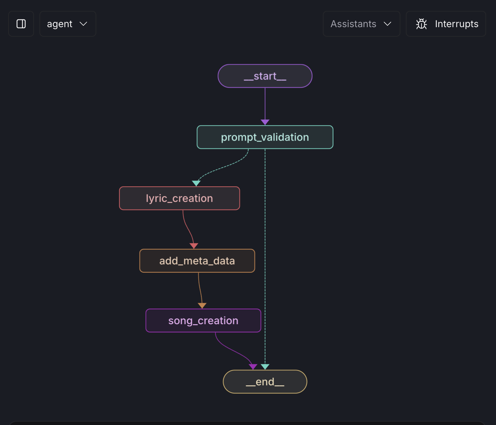

# LyricMind

## WIP

## Overview
This project is aimed to make Agents that can help produce music lyrics given a prompt and descriptions. Maybe in the future scope I will include models to output music. Either way I would like it to be better than just asking chatGPT.

## Installation

### Prerequisites

- **LangGraph Studio**: This project uses LangGraph Studio, which is currently available only for macOS users.

### Installation Steps

1. **Install LangGraph Studio**
   - Download and install LangGraph Studio from [this link](https://github.com/langchain-ai/langgraph-studio) (for macOS only).
   
2. **Clone the Repository**
   - Clone the LyricMind repository to your local machine
   
3. **Run Docker**
   - Docker is needed for LangGraph Studio

4. **Setup LangGraph**
   - Follow the LangGraph Studio documentation to set up your environment.

## Usage

1. **Provide Input**
   - Input your prompts and descriptions when prompted by the script. Make sure its long and informative

3. **View Results**
   - Review the generated lyrics based on your input.

## Future Development

- **Music Production**: Integration of models for generating music tracks to complement the lyrics.
- **Enhanced Customization**: More options for tailoring the lyrics to user preferences.

## Contributing

Contributions are welcome! If you have suggestions or improvements, please submit a pull request or open an issue.
